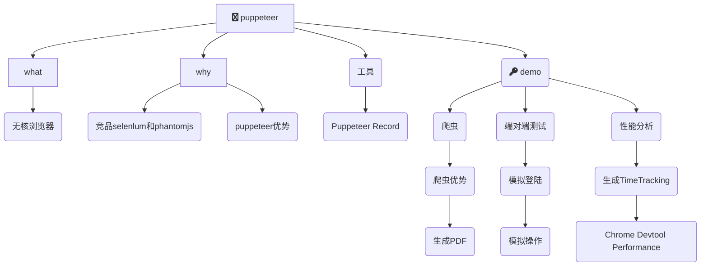

title: puppeteer
speaker: wanglei
plugins:

    - mermaid

<slide :class="size-200" style="width:100% !important">

## what、why {.aligncenter}

```mermaid
graph TD
    B["fa:fa-chrome puppeteer"]
    B-->C[what]
    B-->D[why];
    B-->E(fa:fa-key demo);
    B-->F(工具);
    C-->G(无核浏览器)
    D-->H(竞品selenlum和phantomjs)
    D-->I(puppeteer优势)
    F-->J(Puppeteer Record)
    E-->K(爬虫)
    E-->L(端对端测试)
    E-->M(性能分析)
    K-->K1(爬虫优势)
    K1-->K2(生成PDF)
    L-->L1(模拟登陆)
    L1-->L2(模拟操作)
    M-->M1(生成TimeTracking)
    M1-->M2(Chrome Devtool Performance)
```
